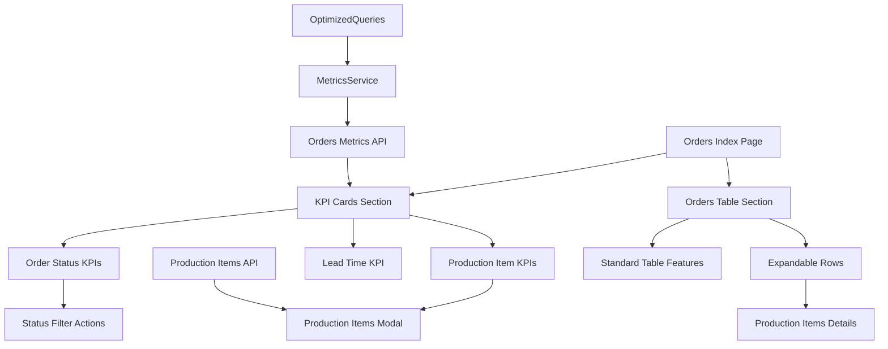

# Orders KPI Dashboard - Design Document

## Overview

The Orders KPI Dashboard enhances the existing Orders list view with a comprehensive set of Key Performance Indicators (KPIs) that provide real-time insights into order statuses, production metrics, and lead times. The design builds upon the existing orders page architecture while adding interactive KPI cards, expandable order rows, and modal views for detailed production item listings.

## Architecture

### High-Level Architecture



### Component Structure

The design maintains the existing Vue.js component structure while adding new reactive elements:

- **KPI Cards Grid**: Interactive metric displays with click handlers
- **Expandable Table Rows**: Enhanced table with nested production item details
- **Production Items Modal**: Full-screen modal for detailed item listings
- **Enhanced Metrics API**: Extended API endpoints for production item queries

## Components and Interfaces

### 1. KPI Cards Component Structure

#### Order Status KPI Cards
- **Orders Pending**: Clickable card filtering by PENDING status
- **Orders Approved**: Clickable card filtering by APPROVED status  
- **Orders In Progress**: Clickable card filtering by ORDER_PROCESSING status
- **Orders Ready To Ship**: Clickable card filtering by READY_TO_SHIP status
- **Orders Completed**: Clickable card filtering by COMPLETED status

#### Production Item KPI Cards
- **Items in Production**: Clickable card showing modal with items in CUTTING, SEWING, FOAM_CUTTING, PACKAGING
- **Items Not Started**: Clickable card showing modal with items in NOT_STARTED_PRODUCTION
- **Items Completed**: Clickable card showing modal with items in PRODUCT_FINISHED, READY

#### Performance KPI Card
- **Average Lead Time**: Non-clickable display showing average time from CUTTING to completion (last 60 days)

### 2. Enhanced Orders Table

#### Expandable Row Structure
```typescript
interface ExpandableOrderRow {
  orderId: string;
  isExpanded: boolean;
  productionItems: ProductionItem[];
}

interface ProductionItem {
  id: string;
  itemName: string;
  itemStatus: ItemStatus;
  isVerified: boolean;
  productAttributes: {
    size?: string;
    shape?: string;
    color?: string;
  };
}
```

#### Row Expansion Logic
- Show chevron icon only for orders containing production items (`isProduct: true`)
- Toggle expansion state on chevron click
- Display nested table with production item details when expanded
- Maintain independent expansion state for each order row

### 3. Production Items Modal

#### Modal Structure
```typescript
interface ProductionItemsModal {
  isVisible: boolean;
  title: string;
  items: DetailedProductionItem[];
  filterType: 'in_production' | 'not_started' | 'completed';
}

interface DetailedProductionItem {
  id: string;
  itemName: string;
  itemStatus: ItemStatus;
  isVerified: boolean;
  orderNumber: string;
  customerName: string;
  productAttributes: ProductAttributes;
  orderId: string; // For navigation
}
```

#### Modal Features
- Full-screen overlay with scrollable table
- Sortable columns for better data organization
- Clickable order numbers for navigation to order details
- Color-coded status badges for visual clarity
- Close button and overlay click to dismiss

## Data Models

### 1. Enhanced Metrics Response

```typescript
interface OrdersKPIMetrics {
  // Order Status Metrics
  ordersPending: number;
  ordersApproved: number;
  ordersInProgress: number;
  ordersReadyToShip: number;
  ordersCompleted: number;
  
  // Production Item Metrics
  itemsInProduction: number;
  itemsNotStarted: number;
  itemsCompleted: number;
  
  // Performance Metrics
  avgLeadTimeHours: number;
  
  // Detailed Breakdowns
  ordersByStatus: Record<OrderStatus, number>;
  itemsByStatus: Record<ItemStatus, number>;
}
```

### 2. Production Items API Response

```typescript
interface ProductionItemsResponse {
  success: boolean;
  data: ProductionItemDetail[];
  totalCount: number;
  filterApplied: string;
}

interface ProductionItemDetail {
  id: string;
  itemStatus: ItemStatus;
  item: {
    name: string;
    imageUrl?: string;
  };
  order: {
    id: string;
    salesOrderNumber: string;
    customer: {
      name: string;
    };
  };
  productAttributes: {
    verified: boolean;
    size?: string;
    shape?: string;
    color?: string;
  };
}
```

### 3. Expandable Row Data

```typescript
interface OrderWithProductionItems {
  id: string;
  salesOrderNumber: string;
  customer: { name: string };
  orderStatus: OrderStatus;
  priority: Priority;
  totalAmount: number;
  createdAt: Date;
  items: OrderItemWithDetails[];
}

interface OrderItemWithDetails {
  id: string;
  isProduct: boolean;
  itemStatus: ItemStatus;
  item: { name: string };
  productAttributes: {
    verified: boolean;
    size?: string;
    shape?: string;
    color?: string;
  };
}
```

## Error Handling

### 1. KPI Calculation Errors

```typescript
interface KPIErrorHandling {
  // Graceful degradation for failed metrics
  fallbackValues: {
    ordersPending: 0;
    ordersApproved: 0;
    ordersInProgress: 0;
    ordersReadyToShip: 0;
    ordersCompleted: 0;
    itemsInProduction: 0;
    itemsNotStarted: 0;
    itemsCompleted: 0;
    avgLeadTimeHours: 0;
  };
  
  // Error state display
  errorMessage: string | null;
  retryFunction: () => Promise<void>;
}
```

### 2. Modal Loading States

```typescript
interface ModalErrorStates {
  loading: boolean;
  error: string | null;
  empty: boolean;
  retryAvailable: boolean;
}
```

### 3. Row Expansion Errors

- Handle cases where production items fail to load
- Show placeholder content for missing data
- Provide retry mechanisms for failed expansions

## Testing Strategy

### 1. Unit Tests

#### KPI Calculation Tests
```typescript
describe('KPI Calculations', () => {
  test('should calculate items in production correctly', () => {
    // Test items with status CUTTING, SEWING, FOAM_CUTTING, PACKAGING
    // Exclude NOT_STARTED_PRODUCTION, PRODUCT_FINISHED, READY
    // Only count items with isProduct: true
  });
  
  test('should calculate average lead time for last 60 days', () => {
    // Test lead time calculation from CUTTING to completion
    // Verify 60-day window filtering
  });
  
  test('should handle missing production logs gracefully', () => {
    // Test fallback behavior for incomplete data
  });
});
```

#### Component Interaction Tests
```typescript
describe('KPI Card Interactions', () => {
  test('should filter orders when status KPI clicked', () => {
    // Test order list filtering on KPI card click
  });
  
  test('should open modal when production KPI clicked', () => {
    // Test modal opening with correct data
  });
  
  test('should expand row when chevron clicked', () => {
    // Test row expansion functionality
  });
});
```

### 2. Integration Tests

#### API Integration Tests
```typescript
describe('Orders Metrics API', () => {
  test('should return correct KPI values', () => {
    // Test API response structure and values
  });
  
  test('should handle filtering parameters', () => {
    // Test API filtering by status, date, customer
  });
});

describe('Production Items API', () => {
  test('should return filtered production items', () => {
    // Test production item filtering by status
  });
  
  test('should include related order and customer data', () => {
    // Test data relationships and includes
  });
});
```

### 3. End-to-End Tests

#### User Workflow Tests
```typescript
describe('KPI Dashboard Workflows', () => {
  test('should complete full KPI interaction workflow', () => {
    // 1. Load orders page with KPIs
    // 2. Click on production items KPI
    // 3. View modal with production items
    // 4. Click on order number to navigate
    // 5. Return to orders page
  });
  
  test('should complete row expansion workflow', () => {
    // 1. Load orders page
    // 2. Expand order row
    // 3. View production item details
    // 4. Collapse row
  });
});
```

## Implementation Approach

### Phase 1: Backend API Enhancements

1. **Enhance Orders Metrics API** (`server/api/metrics/orders.get.ts`)
   - Add new KPI calculations for approved orders
   - Fix items in production calculation logic
   - Remove total orders metric
   - Ensure proper filtering for production items only

2. **Create Production Items API** (`server/api/admin/order-items/production.get.ts`)
   - New endpoint for fetching production items by status
   - Support filtering by in_production, not_started, completed
   - Include related order, customer, and product attribute data

3. **Update MetricsService** (`utils/metricsService.ts`)
   - Add new KPI calculation methods
   - Ensure proper production item filtering (`isProduct: true`)
   - Optimize queries for performance

### Phase 2: Frontend KPI Cards

1. **Update Orders Index Page** (`pages/admin/orders/index.vue`)
   - Replace existing KPI cards with new interactive design
   - Add click handlers for filtering and modal opening
   - Implement proper loading and error states
   - Maintain existing layout and styling patterns

2. **Add KPI Interaction Logic**
   - Implement order filtering on status KPI clicks
   - Add modal opening logic for production item KPIs
   - Ensure proper state management for filters

### Phase 3: Expandable Rows

1. **Enhance Orders Table**
   - Add chevron icons for orders with production items
   - Implement row expansion state management
   - Create nested table component for production item details

2. **Add Production Item Display**
   - Show item status with color-coded badges
   - Display verification status
   - Format product attributes for readability

### Phase 4: Production Items Modal

1. **Create Modal Component**
   - Full-screen modal with scrollable table
   - Sortable columns for better data organization
   - Clickable order numbers for navigation

2. **Implement Modal Logic**
   - API calls for different production item types
   - Loading and error state handling
   - Proper modal lifecycle management

### Phase 5: Testing and Optimization

1. **Performance Testing**
   - Ensure KPI calculations complete within 3 seconds
   - Test with large datasets
   - Optimize database queries if needed

2. **User Experience Testing**
   - Test responsive design on different screen sizes
   - Verify accessibility compliance
   - Ensure smooth interactions and transitions

## Backward Compatibility Considerations

### Preserved Functionality

1. **Existing Order List Features**
   - All current search, sorting, and pagination functionality
   - Existing filter controls (customer, status, priority)
   - Current table columns and data display
   - Archive and sync functionality

2. **Existing API Endpoints**
   - No modifications to existing order CRUD operations
   - Preserved response formats for existing endpoints
   - Maintained existing authentication and authorization

3. **Existing UI Components**
   - Preserved existing buttons, links, and navigation
   - Maintained current modal functionality (archive, verify)
   - Kept existing styling and layout patterns

### Integration Points

1. **Metrics API Enhancement**
   - Extend existing metrics endpoint without breaking changes
   - Add new fields while maintaining existing response structure
   - Ensure backward compatibility with existing metric consumers

2. **Database Query Optimization**
   - Enhance existing queries without changing core logic
   - Add new indexes if needed without affecting existing performance
   - Maintain existing data relationships and constraints

3. **Component Integration**
   - Add new components alongside existing ones
   - Use existing utility functions and composables
   - Follow established patterns for state management and error handling

This design ensures that the KPI dashboard enhancement integrates seamlessly with the existing orders management system while providing powerful new insights and interactions for users.